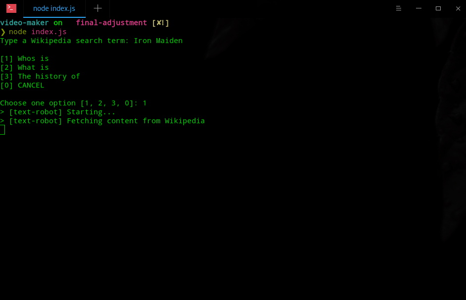
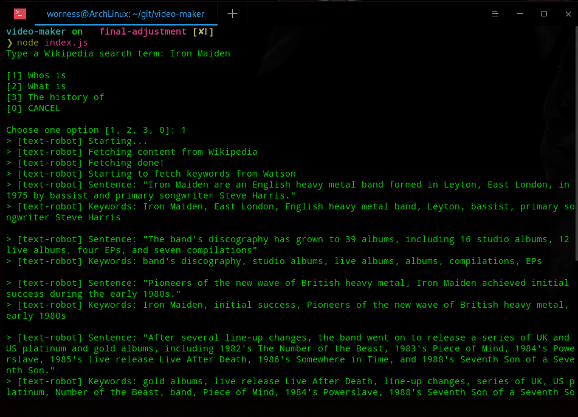
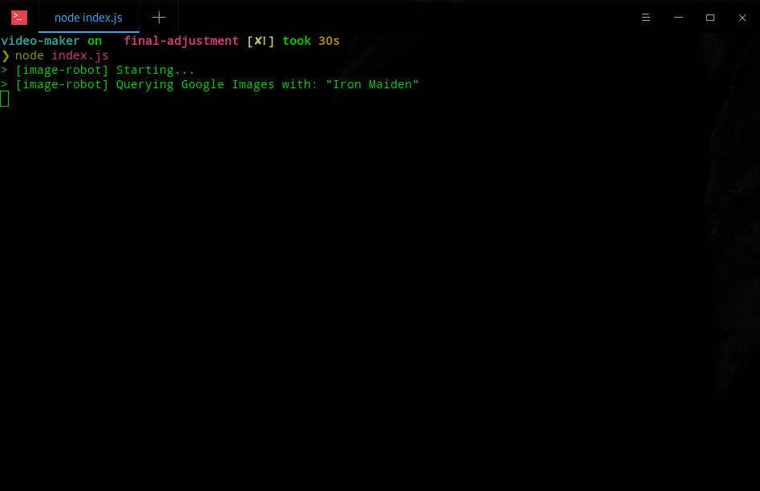
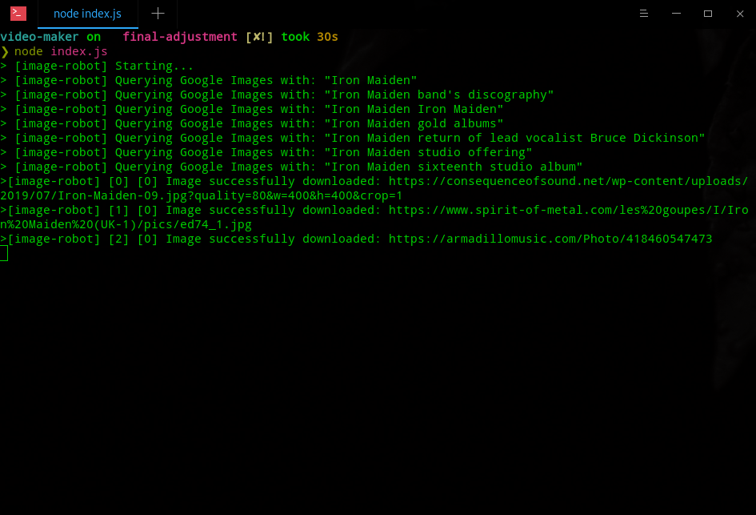
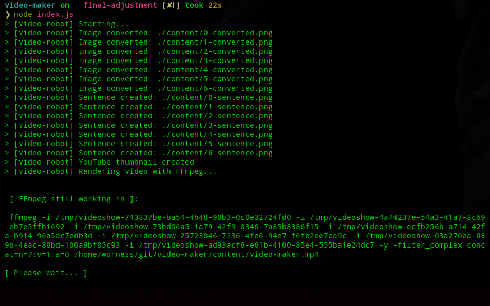
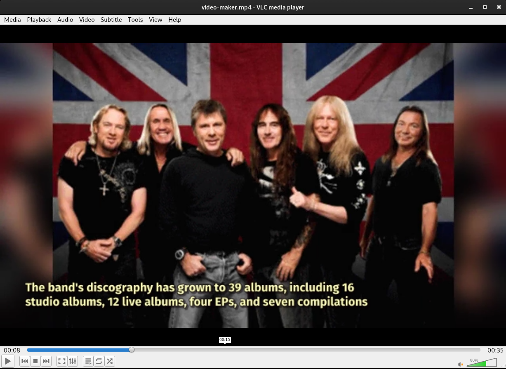
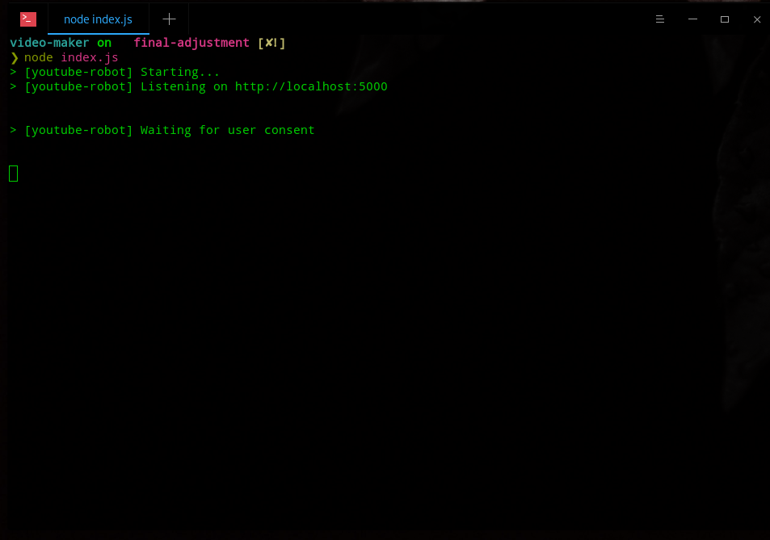
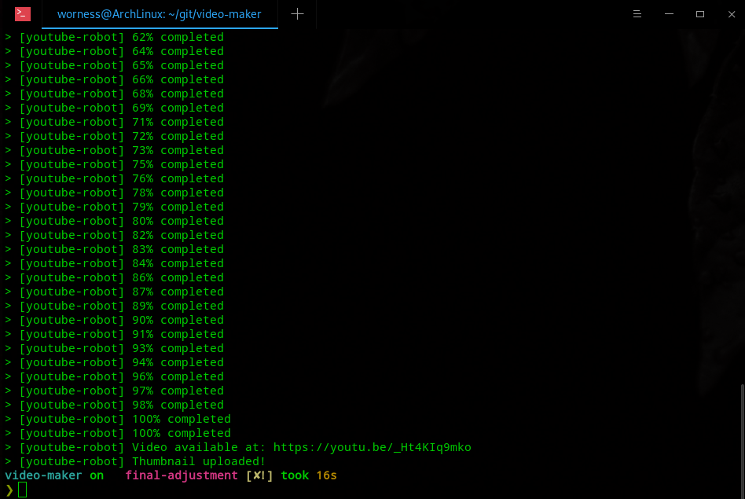
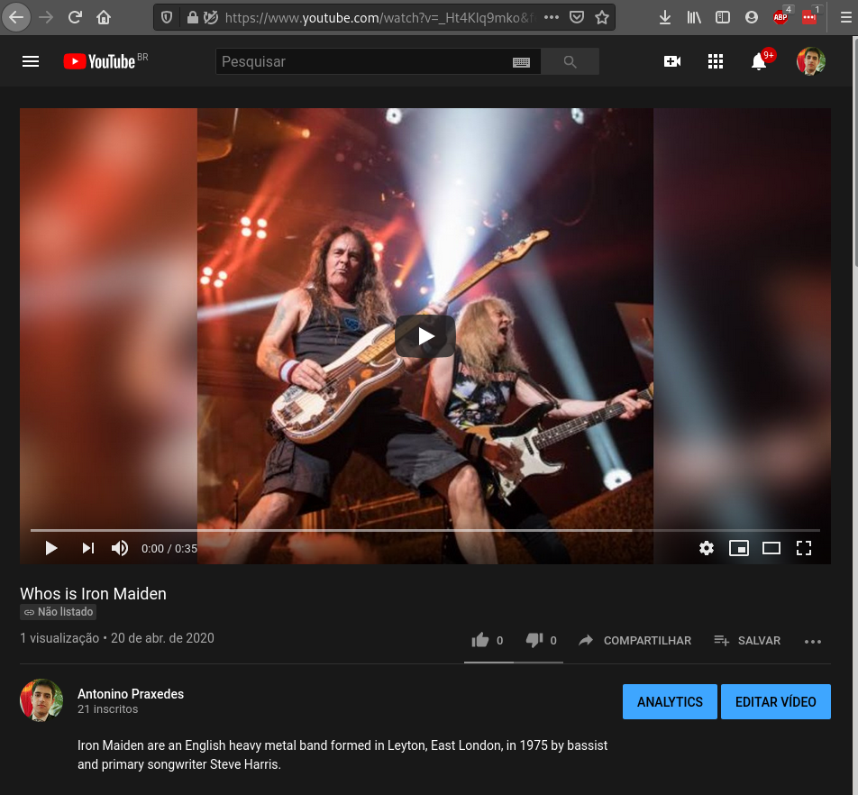

## Sobre o projeto :bulb:

Trata-se de uma POC (Prova de conceito) do projeto de código-aberto do [Filipe Deschamps](https://github.com/filipedeschamps/video-maker), onde basicamente o usuário entra com algum tema de pesquisa, depois escolhe o filtro de entrada: "Who is", "What is" e "The history of". Onde a API de busca no Wikipedia da [Algorithmia](https://algorithmia.com/), utilizará da Machine Learning para efetuar o resumo com base no filtro escolhido anteriormente pelo usuário. 

Com o resumo do conceito salvo, a próxima etapa será extrair os metadados e as "keywords" com o uso da API de [Natural Language Understanding](https://www.ibm.com/br-pt/cloud/watson-natural-language-understanding) da Inteligência Artificial Watson da IBM. 

Após as "keywords" coletadas, serão utilizadas como base de busca das imagens sobre o assunto, utilizando a API do Google Search/Image.

Com as imagens organizadas, será aplicado todo o template pré-fixado no vídeo, convertendo as imagens extraídas, legendas com o texto/conceito recolhido na primeira fase em formato ".mp4". No projeto original, utilizou-se o After Effects. Contudo, por se tratar de uma ferramente paga, substitui por duas ferramentas open sources para aplicação de efeitos e conversão do vídeo: [Videoshow](https://www.npmjs.com/package/videoshow) e [FFmpeg](https://www.ffmpeg.org/) respectivamente.

Com o vídeo pronto, será utilizado o serviço do Google Cloud, aplicando-se a API do YouTube para Upload do vídeo automaticamente (já incluindo, nome do vídeo, descrição e Thumbnail).

Todas essas etapas: / Recolher conceito / Download Imagens / Renderização Vídeo / Upload YouTube / poderão ser utilizadas separademente.

## :information_source: How To Use

Por ser uma POC, necessitará das chaves das API's utilizadas no projeto. Clicando [aqui](https://github.com/filipedeschamps/video-maker), será direcionado ao README do projeto original com os passos para configuração.

Na minha adapação para ferramenta FREE, precisará das dependências:

```bash
# Videoshow
$ npm i videoshow

# FFmpeg
$ npm install ffmpeg

# @ffmpeg-installer/ffmpeg
$ npm install --save @ffmpeg-installer/ffmpeg

# @ffprobe-installer/ffprobe
$ npm install --save @ffprobe-installer/ffprobe
```
Demais dependências utilizadas:

```bash
# Readline
$ npm install readline-sync

## Algorithmia Market Place Machine Learning
$ npm i algorithmia

# Natural Language Understanding
$ npm i watson-developer-cloud and 
$ npm i ibm-watson

# Google APIs
$ npm i googleapis

# Image Downloader
$ npm i image-downloader

# ImageMagick
https://imagemagick.org/script/download.php

# GM
$ npm i gm

# Express
$ npm i express
```

## ScreenShots

<p align="center">
  
  
  
  
  
  
  
  
  
</p>

<p>Check out Youtube: https://www.youtube.com/watch?v=_Ht4KIq9mko&feature=youtu.be</p>

---
:wave: [Entrar em contato no LinkedIn](https://www.linkedin.com/in/antoninopraxedes/)

